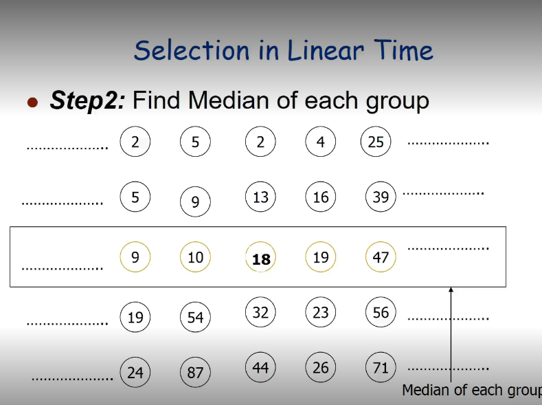

# A mediana das medianas é um algoritmo de seleção usado para encontrar o k-ésimo menor elemento em uma lista não ordenada. 

# Entrada = 2,54,44,4,25,5,5,32,23,39,9,87,18,26,47,19,9,13,16,56,24,10,2,19,71

# Saida = 18

